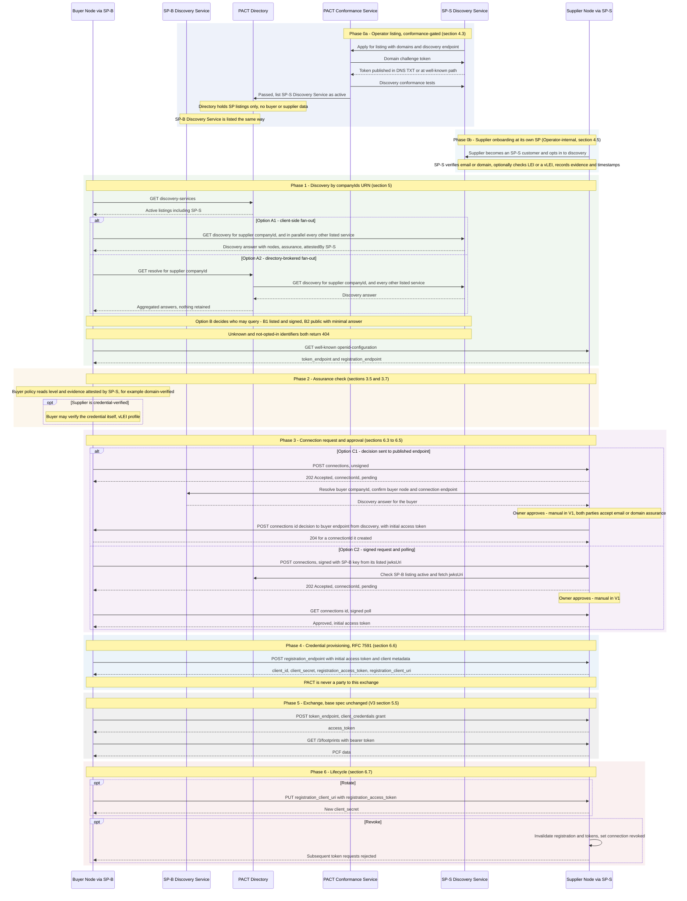
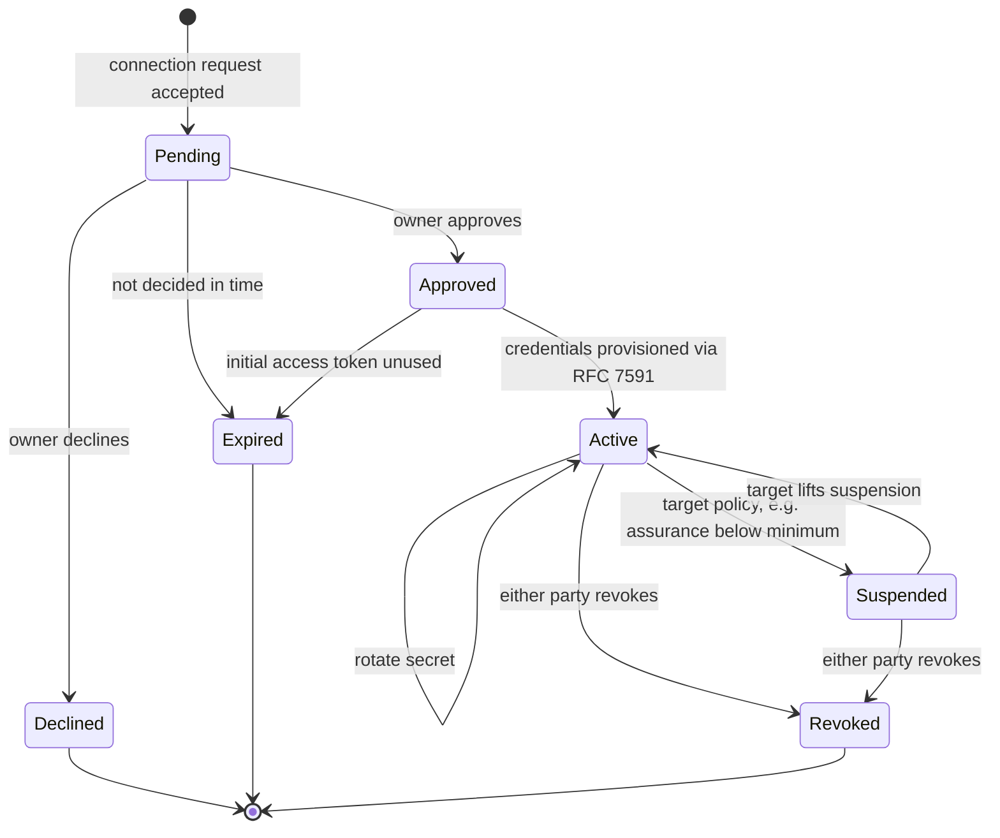

# PACT Identity Management — Discover, Verify, Connect (Flow)

*Draft v0.2 — 16 September 2026. Non-normative figure supporting §4 (Registration), §5 (Node Discoverability) and §6 (Automated Credential Exchange) of the PACT Identity Management addendum. Reflects the 2 September 2026 WG decisions: a **PACT Directory of Discovery Services** holding no buyer or supplier data, **domain ownership inside discovery conformance** for Operators, **LEI and verifiable credentials as optional layers**, and **email/domain assurance attested by each party's own Operator**. **RFC 7591 Dynamic Client Registration** remains the credential-provisioning binding.*

> **Changes in v0.2.** Registration now happens in two layers: the Operator is listed through conformance, and the supplier is onboarded by its Operator. The root no longer holds delegations keyed by LEI. Discovery fans out across Discovery Services. The GLEIF lookup is optional and performed by the Operator. The three open WG decisions (A fan-out, B query authorisation, C request authentication) are shown as alternatives.

The scenario: a **buyer** wants PCF data from a **supplier** it has never exchanged with. Both are customers of different solution providers: **SP-B** serves the buyer, **SP-S** serves the supplier. Nothing in the flow puts PACT in the credential or data path.

---

## End-to-end flow

---

## What happens at each phase

**Phase 0a — Operator listing.** SP-S applies to the PACT Directory. The PACT Conformance Service checks that SP-S controls its domain (a DNS `TXT` record or a file under `/.well-known/`) and runs the discovery conformance tests. Only then is the Discovery Service listed. A home-built solution that has not passed these tests cannot be listed. The Directory holds the SP's listing and nothing about its customers. SP-B goes through the same steps. A company running its own node is listed in exactly the same way, as an *SP of one*.

**Phase 0b — Supplier onboarding.** The supplier signs up with SP-S and opts in to being discoverable. SP-S decides how to verify it: typically an email or domain check, optionally an LEI status check or a verifiable credential. SP-S records what it checked and when. None of this goes to PACT.

**Phase 1 — Discovery.** The buyer fetches the Directory listing and looks the supplier up by a `companyIds` URN. Under **Option A1** the buyer queries every listed Discovery Service itself. Under **Option A2** the Directory does that on its behalf and keeps nothing. **Option B** decides whether queries must be signed by a listed Operator or may be public with a minimal answer. A `404` never reveals whether an identifier is unknown or simply not opted in. The buyer then reads the supplier node's existing `/.well-known/openid-configuration` for the token and registration endpoints, so no Directory or Discovery Service ever holds, or goes stale on, those values.

**Phase 2 — Assurance check.** The answer carries an assurance level (*self-asserted*, *email-verified*, *domain-verified*, *registry-verified*, *credential-verified*), the evidence behind it, and which SP attests it. The buyer's policy decides whether that is enough. For v1, email or domain assurance is enough where both parties agree. A credential can be checked directly where one is bound.

**Phase 3 — Connection.** The buyer asks to connect, and the supplier's owner approves. **Option C1** needs no cryptography: the supplier confirms the buyer's node through SP-B's Discovery Service and sends the approval, with the one-time token, only to the endpoint published there. Anyone impersonating the buyer never receives it. **Option C2** has the buyer's SP sign the request with a key under its verified domain, and the buyer polls for the decision. **Being discoverable is not being connected:** approval is always the supplier's, and always explicit.

**Phase 4 — Credential provisioning.** The buyer spends the one-time initial access token at the supplier's RFC 7591 registration endpoint. It receives the `client_id` and `client_secret` the base specification's OAuth flow already expects, plus the RFC 7592 handles that make rotation possible without a second manual handshake. This is the exact step V3 §5.3 leaves out of scope, and it happens strictly peer-to-peer.

**Phase 5 — Exchange.** Unchanged from V3 §5.5.

**Phase 6 — Lifecycle.** Rotation is a client-initiated update against the registration URI. Revocation invalidates the registration and all live tokens. Delisting an SP, or a supplier withdrawing from discovery, is *not* revocation: credentials survive until they are revoked here (§4.4.3, §6.7.2).

---

## Appendix — connection lifecycle states

*Non-normative companion view of Phases 3 to 6.*

---

## Notes and open items

- The flow shows a **one-directional** connection: the buyer becomes an OAuth client of the supplier. Where two parties exchange in both directions, the flow runs twice, independently.
- **Options A, B and C** are open WG decisions. The natural pairings are A1 or A2 with **B2 + C1** (no keys anywhere) or with **B1 + C2** (one key pair per SP, used for both queries and requests). Each combination costs an SP three new PACT-specific methods (§10.1).
- Under Option C1 the buyer must itself be discoverable through SP-B. Under C2 it need not be.
- How parties learn about Directory changes, new versions, and counterparty revocation is parked item P1.
- Delegated-role credentials (an SP proving it is the authorised exchange agent for a customer) would appear in Phases 0b and 3. They are a named extension, not V1.
