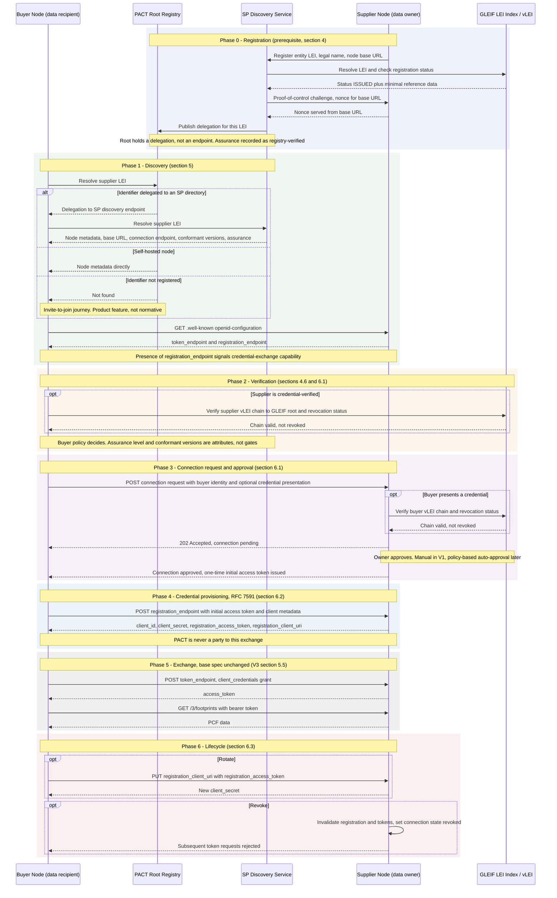
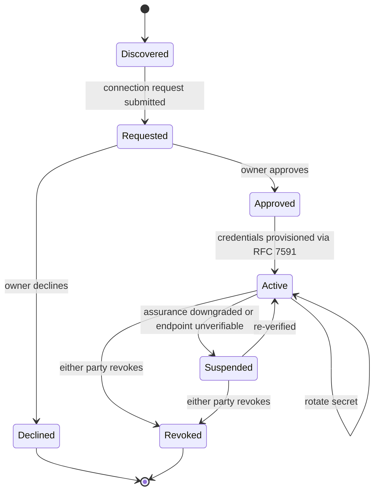

# PACT Identity Management — Discover, Verify, Connect (Flow)

*Draft v0.1 — 1 September 2026. Non-normative figure supporting §4 (Registration), §5 (Node Discoverability) and §6 (Automated Credential Exchange) of the PACT Identity Management addendum. Assumes the two positions taken as settled in the current drafts: **LEI as the primary organisational identifier** and **RFC 7591 Dynamic Client Registration** as the credential-provisioning binding.*

The scenario: a **buyer** wants PCF data from a **supplier** it has never exchanged with. The supplier does not run its own node — it is fronted by a solution provider's directory (the umbrella / SP-node case). The buyer runs its own node. Nothing in the flow puts PACT in the credential or data path.

---

## End-to-end flow

---

## What happens at each phase

**Phase 0 — Registration.** The supplier's solution provider registers the supplier's LEI and node against its own directory; the directory checks the LEI resolves and is `ISSUED`, proves the node controls the declared base URL, and publishes a *delegation* to the root registry. The root index stays thin: identifier to directory, never a copy of GLEIF reference data. Assurance is recorded as an attribute (`registry-verified`), not as an admission test. The buyer registers the same way, self-hosted, so the root holds its node metadata directly.

**Phase 1 — Discovery.** The buyer resolves the supplier's LEI. Because that identifier is delegated, the root answers with a pointer and the buyer re-queries the SP directory, which returns the node metadata for the customer it fronts — subject to that customer's per-node opt-in. Resolution is on by default for authenticated members and off for anonymous requesters; being *listed* in search is a separate control, off by default. If the supplier is not registered at all, the flow leaves the spec and becomes an invite journey.

The buyer then reads the supplier node's existing `/.well-known/openid-configuration`. This is where the token endpoint lives already, and where the RFC 7591 `registration_endpoint` is advertised — so the directory never has to hold, or go stale on, either value.

**Phase 2 — Verification.** Optional and buyer-driven. Where the supplier has bound a vLEI, the buyer verifies the credential chain to the GLEIF root and checks it has not been revoked. Where it has not, the buyer sees `self-asserted` or `registry-verified` and decides for itself. Verification never blocks discovery; it informs the decision to connect.

**Phase 3 — Connection.** The buyer submits a connection request to the supplier node's connection endpoint, optionally presenting its own credential so the supplier can verify *it* in the same way. The supplier's owner approves — manually in V1. **Being discoverable is not being connected:** approval is always the supplier's, and always explicit.

**Phase 4 — Credential provisioning.** Approval yields a one-time initial access token. The buyer uses it against the supplier's RFC 7591 registration endpoint and receives the `client_id` / `client_secret` pair the base specification's OAuth flow already expects, plus the RFC 7592 handles (`registration_access_token`, `registration_client_uri`) that make rotation possible without a second manual handshake. This is the exact step that V3 §5.3 leaves out of scope, and it happens strictly peer-to-peer.

**Phase 5 — Exchange.** Unchanged from V3 §5.5: client-credentials grant, bearer token, the four core actions. Identity Management has produced the credentials and then stepped out of the way.

**Phase 6 — Lifecycle.** Rotation is a client-initiated update against the registration URI; revocation is the supplier invalidating the registration and any live tokens, moving the connection to `revoked`. Note that deregistering from the directory is *not* revocation — credentials survive directory removal until revoked here (§4.9.3).

---

## Appendix — connection lifecycle states

*Non-normative companion view of Phases 3 to 6.*

---

## Notes and open items

- The flow shows a **one-directional** connection: the buyer becomes an OAuth client of the supplier. Where two parties exchange in both directions, the flow runs twice, independently — the supplier/buyer direction is a property of the connection, not of either identity.
- The `202 Accepted` / pending-then-approved shape assumes an asynchronous approval. Whether approval is notified by callback, event, or polling is a §10 question.
- The one-time initial access token is the RFC 7591 mechanism for authorising a registration request. Its issuance, lifetime, and binding to the approved connection need normative text in §6.2.
- Phase 2 verification is drawn as a direct check against the vLEI ecosystem. The precise presentation and verification mechanics are deferred to the vLEI Ecosystem Governance Framework.
- Delegated-role credentials (an SP proving it is the authorised exchange agent for a fronted customer) would appear in Phases 0 and 3; they are a named extension, not V1.
